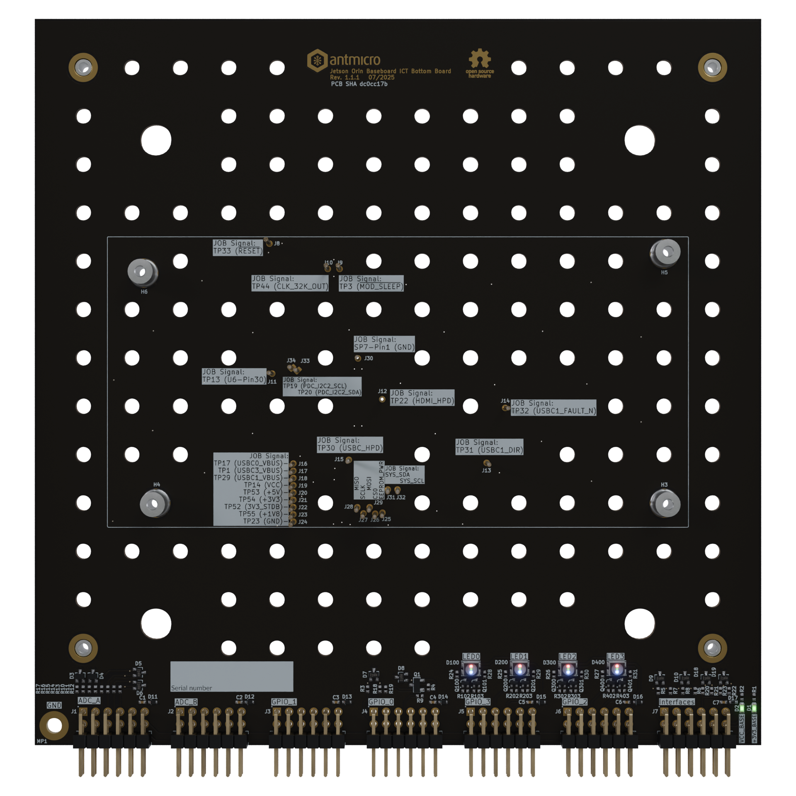

# Jetson Orin Baseboard ICT Bottom Board

Copyright (c) 2025 [Antmicro](https://www.antmicro.com)

## Overview

This project contains open hardware design files of a In-circuit testing (ICT) Bottom Board designed for Antmicro's [Jetson Orin Baseboard](https://github.com/antmicro/jetson-orin-baseboard).
The board connects with the Baseboard's test points via spring loaded test probes and passes the signals to Antmicro's [ICT Baseboard](https://github.com/antmicro/ict-baseboard). The ICT Bottom board is additionally equipped with four RG LEDs to indicate the testing status.

The design files were prepared in KiCad 9.x.

## Key features

* Spring loaded test probes matching the [Jetson Orin Baseboard's](https://github.com/antmicro/jetson-orin-baseboard) pinout
* Four RG LEDs
* ESD protection for all channels
* Compatible with [ICT Baseboard](https://github.com/antmicro/ict-baseboard)

## Project structure

The main directory contains KiCad PCB project files, a LICENSE, and a README.

## Licensing

This project is published under the [Apache-2.0](LICENSE) license.
